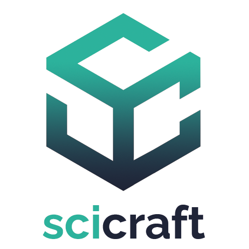

#  Scicraft 
_A mod to add physics and chemistry to your life (and Minecraft)_

This is the first version of the mod. We use the [Fabric](https://fabricmc.net) toolchain. For more info, visit [our website](https://scicraft.be) or join our [Discord server](https://discord.com/invite/g3zMkEXzRN).

## Contributing

New content for the mod is discussed in brainstorm sessions and on [Discord](https://discord.com/invite/g3zMkEXzRN). We encourage everyone who wants to contribute to participate in thinking about new and interesting ways to bring science to Minecraft. Concrete ideas and features are organised in [Issues](https://github.com/ScicraftLearn/Scicraft/issues). These can be used to communicate and plan what you are working on.

For new developers who don't have much experience with modding, we advise to take a look at the [Fabric wik](https://fabricmc.net/wiki/doku.php#developing_with_fabric) and send a message to @Kernteam Development on Discord. We would gladly help you get started!

### Workflow
1. Clone the repository.
2. Request edit access by providing your GitHub handle on the [Discord server](https://discord.com/invite/g3zMkEXzRN).
3. Switch to a new branch for you to work on.
4. When your feature is finished and adequately tested and document, submit a pull request.

Alternatively you can also fork the repository and work in an isolated environment. However, do take care that your version doesn't diverge too far from the main version.